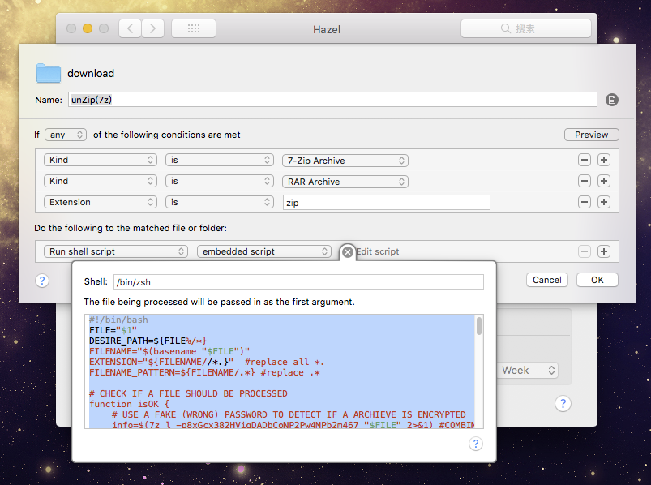

# better-unzip-for-Hazel
A Better unzip script for Hazel app (www.noodlesoft.com), especially for split zip files, base on 7zip Cli

# why?


# preInstall

## install p7zip using Homebrew

```
brew update
brew install p7zip

```

# install

## Copy & Paste Script in a new Rule as below



# test & run

* drag single archieved file into your folder, to see if it will be unarchieved and move to the trash
* drag some split archieved files into your folder, to see if success
* drag some split archieved files(but incomplete) into your folder, to see if show a fail notification

# beyonds

1. [Recursively unzip archives](https://www.noodlesoft.com/manual/hazel/advanced-topics/processing-subfolders/)
2. For Dummies， download this file [download.hazelrules](./download.hazelrules), import using Hazel panel
